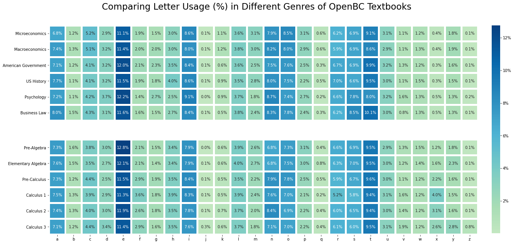
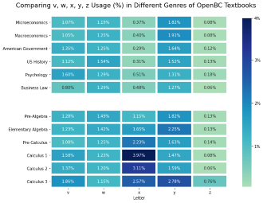
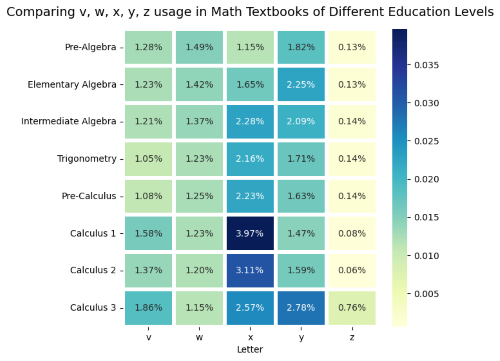

# Language Usage Patterns in Math Textbooks: Normal or Not?

[comment]: <> (![percentages_graph]&#40;./data/percentages_graph.png&#41;)

   
### Inspiration
Upon using various math textbooks throughout my first few years of university studying Statistics & Computer Science, I was (like many others) truly humbled by the use of letters in higher level mathematics. It starts with "f", "x", and "y" in high school, then we add on "z" and "w" in university calculus, then a bunch of "a", "b", "c" for arbitrary integers and "g" and "h" for relations & functions in discrete mathematics. 

The *extremely common* use of "x" and "z" in math, but *extremely **un**common* use of those same letters in the everyday language (except "x-ray" or "xylophone", maybe) led to my main question:

### Main Questions

1) Are there significant differences between letter usage patterns of math textbooks 
   and mainstream forms of written media?
   
2) Are there differences in letter usage patterns between mathematics textbooks and textbooks 
   in *other fields*?

3) Are there significant differences in letter usage between mathematics textbooks of 
the **same topic** but of **different difficulty** levels?
   
#### Sub-Questions
4) Are there any correlations between letters and their frequencies? (E.g. A positive correlation between x usage and z usage)
5) Could a classification algorithm be trained on all the textbooks to determine if a textbook is a math one, or a 
non math one, simply based on the letter frequencies? Or a classification algorithm for textbook or non-textbook?
   
### Viewer Guide
1) To explore how I read online textbooks using Python, see "Math Textbooks vs The World [1] - Data Collection".
2) To see the exploratory data analysis, see "Math Textbooks vs The World [2] - Data Exploration"
3) To explore the answers to the above questions, see "Math Textbooks vs The World [3] - Data Analysis" (In Prog.)

## Key Findings & Visualizations:
1) The language usage of *most* letters in the alphabet is quite **similar** in math textbooks and non-math textbooks, as illustrated in the leading figure.
2) The most significant difference is the letter *x*. Math textbooks used it more than **5 times more** on average (yes, I doubled checked the numbers).
3) On average, the letters that were more common in **math-y** texts than in non-math-y texts were *x* (+523%), *z* (+99%), *f* (+49%), and *y* (21.8%) in relative measures.
4) Letters that were more common in **non-mathy** texts were *k* (+46%), *g* (+16%), *m* (+15%), and *c* (+13%), in relative measures.
5) The biggest difference of non-mathy and math-y books is between v-z, as shown below

6) With harder math textbooks, there is generally an increase of v, x, and z usage, but it's not very consistent.

### Sources & Help
The mathematics textbooks explored include algebra, calculus, and statistics, and will mostly use textbooks by the same team for different year levels. The non-mathematics textbook topics were US History, Business Law, Sociology, Economics, and Psychology. 
All textbooks used were open source, and from the following websites:
- https://open.bccampus.ca/browse-our-collection/find-open-textbooks/
- https://aimath.org/textbooks/approved-textbooks/
- https://pretextbook.org/catalog.html

